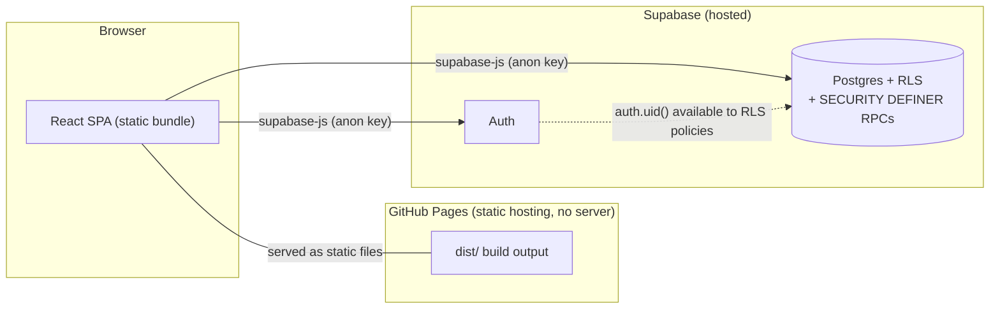
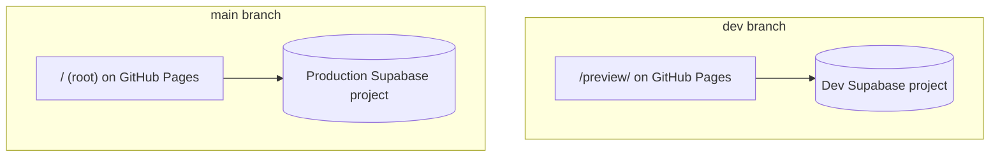
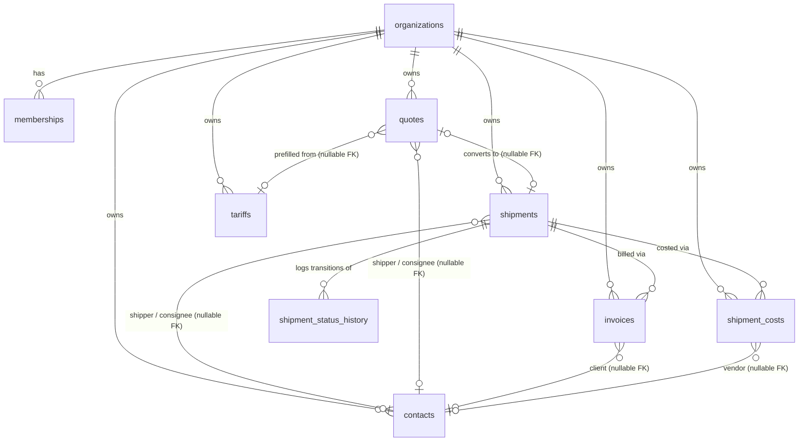
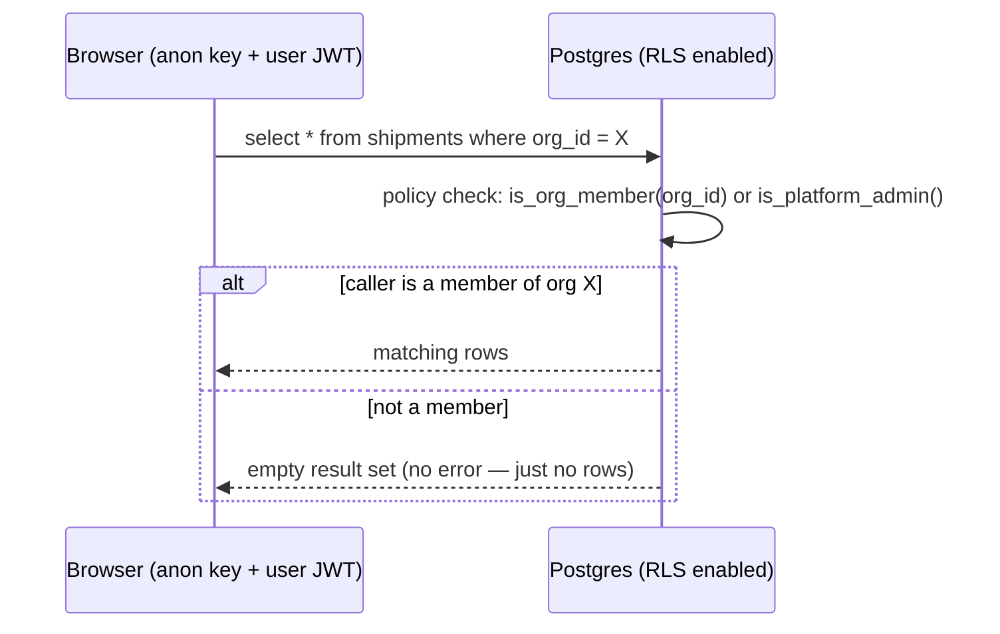
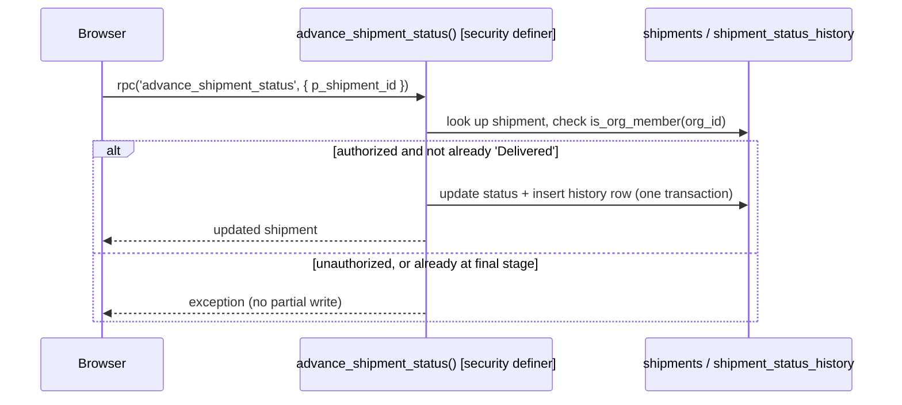

# System Design Document

**Owner:** Software Architect (this role is currently filled by whoever is directing the AI
implementing this project) · **Status:** Living document, updated alongside `docs/adr/` — an ADR
records *why* a decision was made; this document shows *how the pieces fit together as a result*.
If the two ever disagree, the ADR is authoritative for the reasoning and this file needs fixing.

## 1. Architecture style

SST Freight is a **fully static single-page app with no backend service of its own**. The
frontend (React + TypeScript + Vite) talks directly to Supabase's hosted Postgres and Auth from
the browser, using the public "anon" key. There is no Node/Express/serverless layer in between —
every business rule that needs to be trustworthy (not just convenient) is enforced inside
Postgres itself, via Row-Level Security and `SECURITY DEFINER` functions (ADR-0001, ADR-0002).

**Consequence of this shape**: there is no place to hide a server-side secret, run a scheduled
job, or do anything that requires long-running compute. Every feature in this project has had to
fit that constraint — e.g. the FX rate lookup (ADR-0007) is a direct client-side `fetch()` to a
public, no-key API rather than a server-side integration, and the customer tracking link
(ADR-0009) uses a query parameter rather than a router, because there's no server to configure a
rewrite rule on.

## 2. Two environments, two Supabase projects

Both branches deploy to the **same** GitHub Pages site at different paths
(`.github/workflows/deploy.yml`, `keep_files: true` so one deploy never wipes the other). Schema
changes are applied to `dev` first, always — production is a separate, explicit step (see
`docs/migration-runbook.md`).

## 3. Data model

Every tenant-scoped table (everything except `organizations` and `memberships` themselves) has
its own `org_id` and its own RLS policy set (ADR-0001) — there is no shared "all data" table that
a bug could accidentally expose across tenants.

**Reference-plus-snapshot pattern** (ADR-0003): every `contacts` reference above is a *nullable*
foreign key paired with a denormalized name column (`shipments.client`, `quotes.shipper_name`/
`consignee_name`, `invoices.client_name`, `shipment_costs.vendor_name`) — deleting or renaming a
contact never rewrites historical records. Full column definitions live in
`supabase/schema.sql`, not duplicated here (this diagram would drift; the schema file can't).

## 4. Request patterns

**Pattern A — plain RLS-gated table access** (contacts, tariffs, most of quotes/invoices/costs):
the client calls `.select()`/`.insert()`/`.update()` directly; Postgres's RLS policy decides
per-row visibility.

**Pattern B — `SECURITY DEFINER` RPC** (org/membership creation, team role changes, the shipment
status machine, the public tracking endpoint — ADR-0002): the client calls
`supabase.rpc('fn_name', args)`; the function does its own authorization check, then performs a
multi-step or role-sensitive operation atomically.

The rule for which pattern a new feature should use is in `docs/adr/0002-rpc-only-privileged-
mutations.md` and `docs/adr/0006-quote-conversion-without-dedicated-rpc.md` — don't reach for an
RPC by default; reach for one when authorization genuinely can't be expressed as "does this row
belong to my org."

## 5. Security model summary

- **Tenant isolation**: Postgres RLS on every tenant-scoped table (ADR-0001).
- **Privilege escalation surfaces**: team role changes and platform-admin status both have no
  client-reachable path to grant `'owner'` or platform-admin at all (ADR-0002, ADR-0005).
- **Public/no-auth surface**: exactly one function, `get_public_shipment_tracking`, granted to
  the `anon` role — its payload is a deliberately minimal, hand-curated subset of the data,
  documented field-by-field in `docs/api-reference.md`.
- **Full function-level detail**: `docs/api-reference.md`. **Full reasoning for each of the
  above**: the corresponding ADR in `docs/adr/`.

## 6. Known architectural constraints

- No backend/server-side compute — see §1. Anything needing a secret, a scheduled job, or
  long-running work does not fit this architecture as-is.
- No client-side router — a single query-parameter special case in `App.tsx` handles the one
  public route that exists today (ADR-0009). A second public route, or any deep-linkable
  authenticated route, should prompt reconsidering this rather than adding another special case.
- No automated schema rollback — see `docs/migration-runbook.md`.
