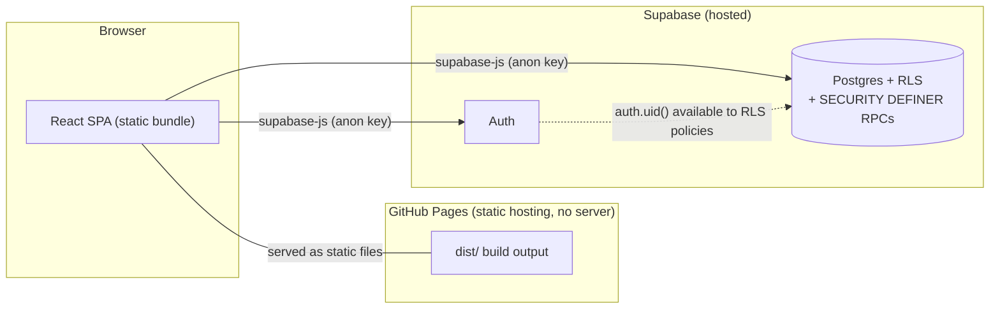
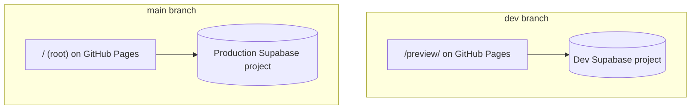
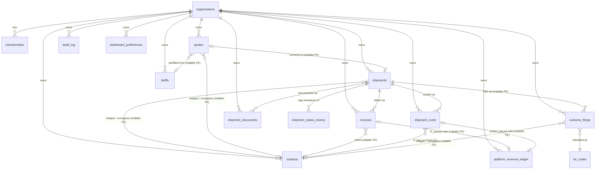
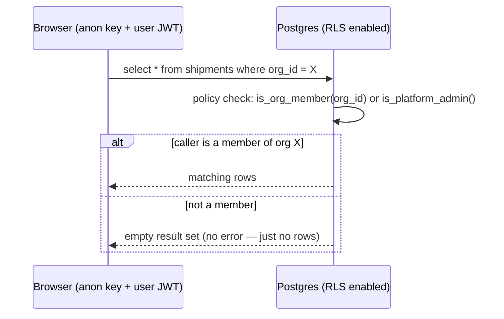
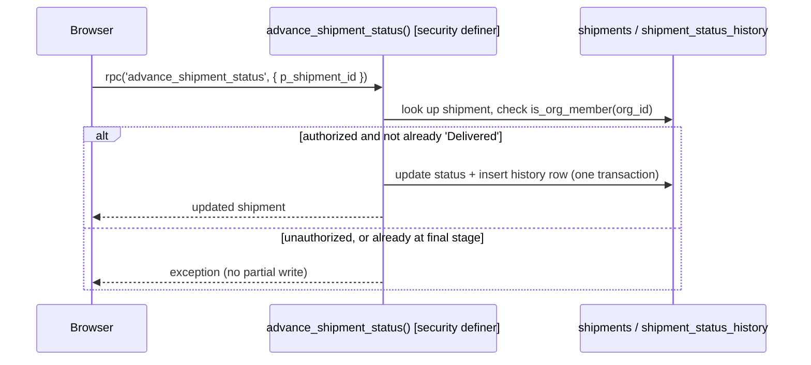

# System Design Document

**Owner:** Software Architect (this role is currently filled by whoever is directing the AI
implementing this project) · **Status:** Living document, updated alongside `docs/adr/` — an ADR
records *why* a decision was made; this document shows *how the pieces fit together as a result*.
If the two ever disagree, the ADR is authoritative for the reasoning and this file needs fixing.

## 1. Architecture style

SST Freight is a **fully static single-page app with no backend service of its own**. The
frontend (React + TypeScript + Vite) talks directly to Supabase's hosted Postgres and Auth from
the browser, using the public "anon" key. There is no Node/Express/serverless layer in between —
every business rule that needs to be trustworthy (not just convenient) is enforced inside
Postgres itself, via Row-Level Security and `SECURITY DEFINER` functions (ADR-0001, ADR-0002).

**Consequence of this shape**: there is no place to run a scheduled job or do anything requiring
long-running compute. Every feature in this project has had to fit that constraint — e.g. the FX
rate lookup (ADR-0007) is a direct client-side `fetch()` to a public, no-key API rather than a
server-side integration, and the customer tracking link (ADR-0009) uses a query parameter rather
than a router, because there's no server to configure a rewrite rule on. **One narrow exception,
added Week 9 (ADR-0014)**: a `SECURITY DEFINER` Postgres function can make an outbound HTTPS call
via the `http` extension, with a secret pulled from Supabase Vault at runtime — this is the one
way this architecture *can* hide a secret (inside the database, not a server), used exactly once
so far, for the carrier-tracking integration. It is not a general-purpose backend; it's a single
extension call from within the same all-Postgres-RPC pattern every other privileged mutation in
this app already uses.

## 2. Two environments, two Supabase projects

Both branches deploy to the **same** GitHub Pages site at different paths
(`.github/workflows/deploy.yml`, `keep_files: true` so one deploy never wipes the other). Schema
changes are applied to `dev` first, always — production is a separate, explicit step (see
`docs/migration-runbook.md`).

## 3. Data model

Every tenant-scoped table (everything except `organizations` and `memberships` themselves) has
its own `org_id` and its own RLS policy set (ADR-0001) — there is no shared "all data" table that
a bug could accidentally expose across tenants.

**Reference-plus-snapshot pattern** (ADR-0003): every `contacts` reference above is a *nullable*
foreign key paired with a denormalized name column (`shipments.client`, `quotes.shipper_name`/
`consignee_name`, `invoices.client_name`, `shipment_costs.vendor_name`) — deleting or renaming a
contact never rewrites historical records. Full column definitions live in
`supabase/schema.sql`, not duplicated here (this diagram would drift; the schema file can't).

**`audit_log`'s reference is deliberately not drawn as an FK relationship** (ADR-0010):
`audit_log.record_id` points into whichever of `contacts`/`memberships`/`invoices`/
`shipment_costs`/`organizations` its `table_name` column names — a polymorphic reference by
design, not a modeling gap, since a real FK per audited table would need a schema change every
time a new table joins the audit scope. One generic `AFTER` trigger (`log_audit_event()`) writes
every row; `list_audit_log()` is the only read path, gated to Owner/Admin.

**Week 10 (ADR-0016)**: `customs_filings` (Bill of Entry / Shipping Bill simulator) follows the
same tenant-scoped shape as every table above — `org_id` + RLS. `hs_codes` does not — it's the
**first global, non-org-scoped table** in this schema, a shared HS/tariff duty-rate reference set
that's identical for every organization, not tenant data. Its RLS policy is `to authenticated
using (true)` for `select` only, deliberately different from every `is_org_member(org_id)` policy
elsewhere; no insert/update/delete grant exists, since the only writer is the seed data in
`schema.sql` itself. Not drawn as owned by `organizations` above precisely because it isn't.

**Week 11 (ADR-0017)**: `shipment_documents` is org-scoped like every table above, but a
`generated` row is a log entry only (type, ref, who, when) — the document itself is rendered live
from current shipment/contact/invoice/customs_filing data on every view, never persisted, so it
can never drift out of sync with the records it's built from. An `uploaded` row instead points at
a real file in the new `shipment-documents` **Supabase Storage** bucket — the first Storage usage
in this app. Storage isn't a separate security model: RLS policies on `storage.objects` extract
the org_id segment from the object's path (`{org_id}/{shipment_id}/{uuid}-{filename}`) and check
it with the same `is_org_member()` every Postgres RLS policy already uses.

**Week 12 (ADR-0018)**: `dashboard_preferences` is the first table in this schema whose RLS checks
`auth.uid() = user_id` in addition to `is_org_member(org_id)` — every other tenant-scoped table
lets any org member see/write any row belonging to their org, which is wrong for a genuinely
personal, per-user dashboard layout. No new RPC was needed for Week 12's reporting views at
all — every KPI/chart/profitability number is computed client-side from tables that already exist
(`shipments`, `invoices`, `shipment_costs`, `shipment_status_history`, `customs_filings`,
`shipment_documents`), the same "plain RLS-gated read, aggregate in the client" shape
`AccountingPage.tsx`'s P&L view already used since Week 6.

**Week 8 (ADR-0012/ADR-0013)**: `organizations` gained `billing_model`, `monthly_fee_inr`, and
`enabled_modules` — the platform-monetization config described in §5. `platform_revenue_ledger`
is the simulated FinTech Slice rake ledger — no real funds move through it (ADR-0013); its
`invoice_id`/`shipment_cost_id` FKs are both nullable since only the `fx_spread` rake ties to an
invoice and only `instant_payout` ties to a shipment cost — `cargo_insurance` ties to neither
directly (it's computed from a shipment's total invoiced amount, opted into per-shipment, not
per-invoice or per-cost).

## 4. Request patterns

**Pattern A — plain RLS-gated table access** (contacts, tariffs, most of quotes/invoices/costs,
customs_filings, shipment_documents): the client calls `.select()`/`.insert()`/`.update()`
directly; Postgres's RLS policy decides per-row visibility. `hs_codes` is a read-only variant of
this same pattern — no insert/update path exists at all, and its `using (true)` policy has no org
dimension to check. `storage.objects` (the `shipment-documents` bucket, Week 11) is the same
pattern applied to Supabase Storage instead of an app table — the client calls
`.storage.from(...).upload()`/`.createSignedUrl()` directly; RLS on `storage.objects` decides
access the same way, just keyed off the object's path instead of an `org_id` column.

**Pattern B — `SECURITY DEFINER` RPC** (org/membership creation, team role changes, the shipment
status machine, the public tracking endpoint — ADR-0002): the client calls
`supabase.rpc('fn_name', args)`; the function does its own authorization check, then performs a
multi-step or role-sensitive operation atomically.

The rule for which pattern a new feature should use is in `docs/adr/0002-rpc-only-privileged-
mutations.md` and `docs/adr/0006-quote-conversion-without-dedicated-rpc.md` — don't reach for an
RPC by default; reach for one when authorization genuinely can't be expressed as "does this row
belong to my org."

## 5. Security model summary

- **Tenant isolation**: Postgres RLS on every tenant-scoped table (ADR-0001).
- **Privilege escalation surfaces**: team role changes and platform-admin status both have no
  client-reachable path to grant `'owner'` or platform-admin at all (ADR-0002, ADR-0005).
- **Public/no-auth surface**: exactly one function, `get_public_shipment_tracking`, granted to
  the `anon` role — its payload is a deliberately minimal, hand-curated subset of the data,
  documented field-by-field in `docs/api-reference.md`.
- **Platform-admin write surface** (Week 8, ADR-0012): `is_platform_admin()` previously only
  appeared as a read-side `or` clause in RLS policies (ADR-0005); `set_org_billing_model` and
  `set_org_config` are the first RPCs where it gates an actual `UPDATE`. Module gating
  (`is_module_enabled`) is enforced the same way as every other privilege boundary in this app —
  inside Postgres RLS `with check` clauses on `tariffs`/`quotes`/`invoices` insert policies, not
  only hidden in the UI.
- **Full function-level detail**: `docs/api-reference.md`. **Full reasoning for each of the
  above**: the corresponding ADR in `docs/adr/`.

## 6. Known architectural constraints

- No backend/server-side compute — see §1. Anything needing a scheduled job or long-running work
  does not fit this architecture as-is. A secret can be hidden narrowly (Postgres Vault + the
  `http` extension inside a single `SECURITY DEFINER` RPC, ADR-0014) but this is not a general
  backend — no request routing, no long-running processes, no arbitrary server-side logic.
- No client-side router — a single query-parameter special case in `App.tsx` handles the one
  public route that exists today (ADR-0009). A second public route, or any deep-linkable
  authenticated route, should prompt reconsidering this rather than adding another special case.
- No automated schema rollback — see `docs/migration-runbook.md`.
