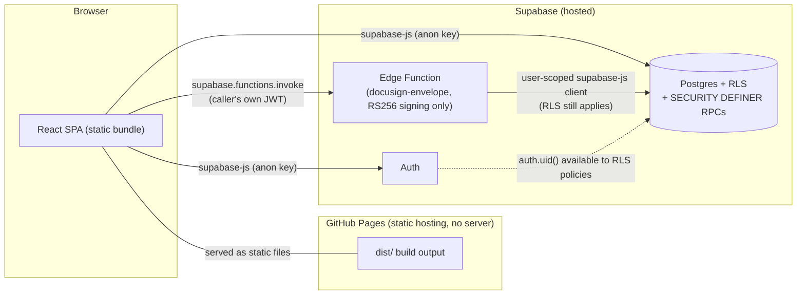
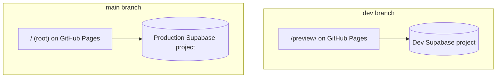
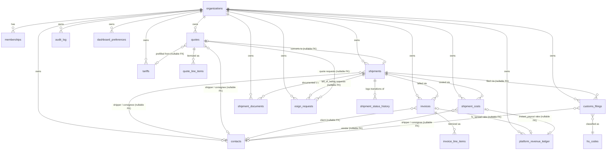
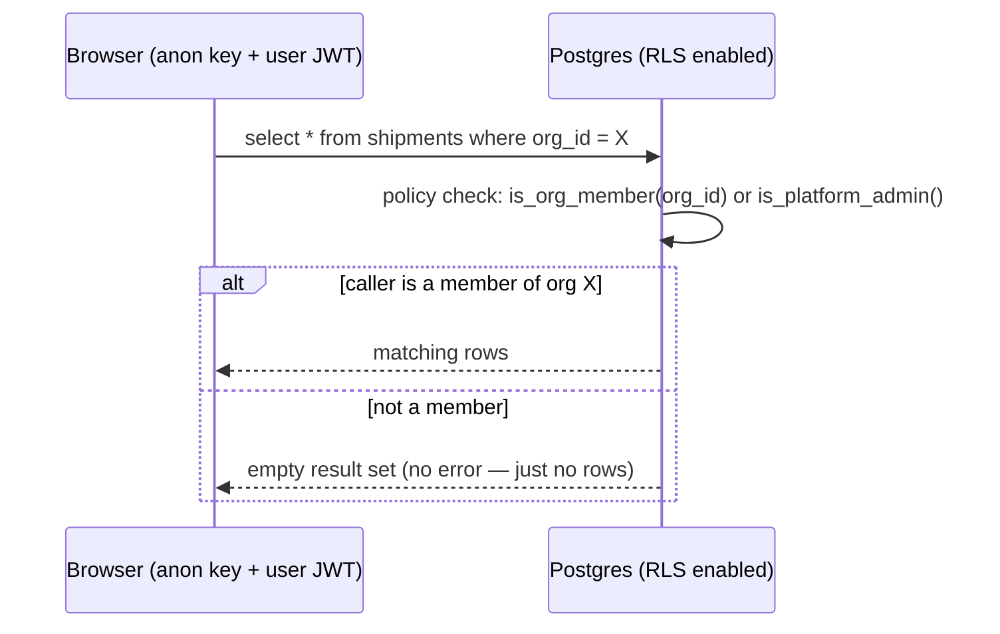
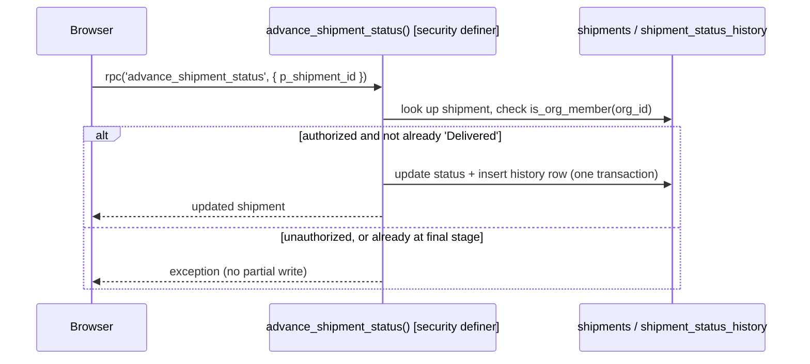
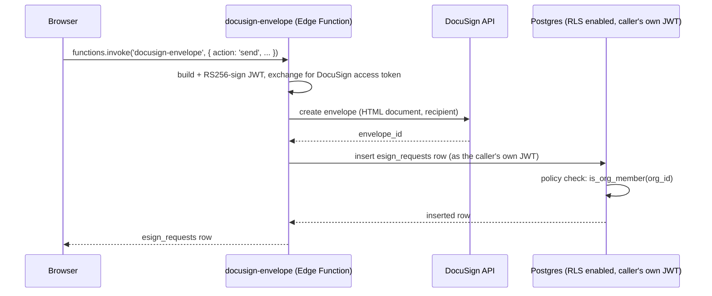
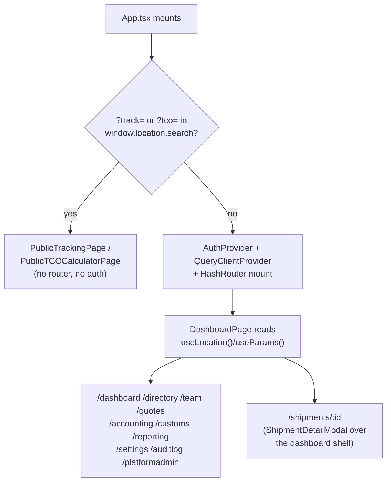

# System Design Document

**Owner:** Software Architect (this role is currently filled by whoever is directing the AI
implementing this project) · **Status:** Living document, updated alongside `docs/adr/` — an ADR
records *why* a decision was made; this document shows *how the pieces fit together as a result*.
If the two ever disagree, the ADR is authoritative for the reasoning and this file needs fixing.

## 1. Architecture style

SST Freight is a **fully static single-page app with no backend service of its own**. The
frontend (React + TypeScript + Vite) talks directly to Supabase's hosted Postgres and Auth from
the browser, using the public "anon" key. There is no Node/Express/serverless layer in between —
every business rule that needs to be trustworthy (not just convenient) is enforced inside
Postgres itself, via Row-Level Security and `SECURITY DEFINER` functions (ADR-0001, ADR-0002).

**Consequence of this shape**: there is no place to run a scheduled job or do anything requiring
long-running compute, and no server to configure a rewrite rule on — every feature in this project
has had to fit that constraint. The FX rate lookup (ADR-0007) is a direct client-side `fetch()` to
a public, no-key API rather than a server-side integration. The in-app router added in ADR-0025 is
`HashRouter`, not `BrowserRouter`, for exactly this reason (a hash URL needs no server-side rewrite
rule at all); the customer tracking link and public TCO calculator (ADR-0009) stay outside that
router entirely, evaluated as plain query-parameter checks before it even mounts — see §7 for the
full routing model. **Two narrow exceptions exist**, both justified the same way — small enough to
not be a general backend:
- **Week 9 (ADR-0014)**: a `SECURITY DEFINER` Postgres function can make an outbound HTTPS call
  via the `http` extension, with a secret pulled from Supabase Vault at runtime — used for the
  carrier-tracking integration, where auth was a static API key (no signing needed).
- **E-signature (ADR-0020)**: a Supabase **Edge Function** (Deno), used *only* because DocuSign's
  JWT Grant needs RS256 signing that no Postgres extension can do. It's deliberately narrow: it
  signs a JWT, calls DocuSign, and uses the *caller's own* Supabase JWT (not a service role) for
  every table read/write — RLS applies exactly as if the browser had called Postgres directly.
  Its own secrets live in Edge Function environment variables, a second, separate secret store
  from Postgres Vault.

## 2. Two environments, two Supabase projects

Both branches deploy to the **same** GitHub Pages site at different paths
(`.github/workflows/deploy.yml`, `keep_files: true` so one deploy never wipes the other). Schema
changes are applied to `dev` first, always — production is a separate, explicit step (see
`docs/migration-runbook.md`).

## 3. Data model

Every tenant-scoped table (everything except `organizations` and `memberships` themselves) has
its own `org_id` and its own RLS policy set (ADR-0001) — there is no shared "all data" table that
a bug could accidentally expose across tenants.

**Reference-plus-snapshot pattern** (ADR-0003): every `contacts` reference above is a *nullable*
foreign key paired with a denormalized name column (`shipments.client`, `quotes.shipper_name`/
`consignee_name`, `invoices.client_name`, `shipment_costs.vendor_name`) — deleting or renaming a
contact never rewrites historical records. Full column definitions live in
`supabase/schema.sql`, not duplicated here (this diagram would drift; the schema file can't).

**`audit_log`'s reference is deliberately not drawn as an FK relationship** (ADR-0010):
`audit_log.record_id` points into whichever of `contacts`/`memberships`/`invoices`/
`shipment_costs`/`organizations` its `table_name` column names — a polymorphic reference by
design, not a modeling gap, since a real FK per audited table would need a schema change every
time a new table joins the audit scope. One generic `AFTER` trigger (`log_audit_event()`) writes
every row; `list_audit_log()` is the only read path, gated to Owner/Admin.

**Week 10 (ADR-0016)**: `customs_filings` (Bill of Entry / Shipping Bill simulator) follows the
same tenant-scoped shape as every table above — `org_id` + RLS. `hs_codes` does not — it's the
**first global, non-org-scoped table** in this schema, a shared HS/tariff duty-rate reference set
that's identical for every organization, not tenant data. Its RLS policy is `to authenticated
using (true)` for `select` only, deliberately different from every `is_org_member(org_id)` policy
elsewhere; no insert/update/delete grant exists, since the only writer is the seed data in
`schema.sql` itself. Not drawn as owned by `organizations` above precisely because it isn't.

**Week 11 (ADR-0017)**: `shipment_documents` is org-scoped like every table above, but a
`generated` row is a log entry only (type, ref, who, when) — the document itself is rendered live
from current shipment/contact/invoice/customs_filing data on every view, never persisted, so it
can never drift out of sync with the records it's built from. An `uploaded` row instead points at
a real file in the new `shipment-documents` **Supabase Storage** bucket — the first Storage usage
in this app. Storage isn't a separate security model: RLS policies on `storage.objects` extract
the org_id segment from the object's path (`{org_id}/{shipment_id}/{uuid}-{filename}`) and check
it with the same `is_org_member()` every Postgres RLS policy already uses.

**E-signature (ADR-0020)**: `esign_requests` is org-scoped like every other table — it's just a
log of DocuSign envelope state (`sent`/`delivered`/`completed`/`declined`/`voided`), one row per
Quote or Bill of Lading sent for signature. The actual DocuSign call (JWT signing + Envelopes API)
happens in the `docusign-envelope` Edge Function (§1), not a Postgres RPC — the table itself needs
no special RLS shape because the Edge Function reads/writes it with the caller's own JWT, so
`is_org_member(org_id)` already covers it exactly like `customs_filings`/`shipment_documents`.

**Week 12 (ADR-0018)**: `dashboard_preferences` is the first table in this schema whose RLS checks
`auth.uid() = user_id` in addition to `is_org_member(org_id)` — every other tenant-scoped table
lets any org member see/write any row belonging to their org, which is wrong for a genuinely
personal, per-user dashboard layout. No new RPC was needed for Week 12's reporting views at
all — every KPI/chart/profitability number is computed client-side from tables that already exist
(`shipments`, `invoices`, `shipment_costs`, `shipment_status_history`, `customs_filings`,
`shipment_documents`), the same "plain RLS-gated read, aggregate in the client" shape
`AccountingPage.tsx`'s P&L view already used since Week 6.

**White-label branding (ADR-0019)**: `organizations` gained `logo_url`, editable only via the new
`update_org_branding()` RPC (`is_org_admin()`-gated — an org's own Owner/Admin, not a platform
admin). The logo file itself lives in **`org-logos`, the first *public* Storage bucket** in this
app — a deliberate contrast with Week 11's private `shipment-documents` bucket: a company logo
isn't sensitive the way a shipment's customs documents are, so `getPublicUrl()` is the right,
simpler fit, with a fixed `{org_id}/logo` path (upsert on replace) rather than Week 11's
uuid-per-upload immutable-log convention.

**Week 8 (ADR-0012/ADR-0013)**: `organizations` gained `billing_model`, `monthly_fee_inr`, and
`enabled_modules` — the platform-monetization config described in §5. `platform_revenue_ledger`
is the simulated FinTech Slice rake ledger — no real funds move through it (ADR-0013); its
`invoice_id`/`shipment_cost_id` FKs are both nullable since only the `fx_spread` rake ties to an
invoice and only `instant_payout` ties to a shipment cost — `cargo_insurance` ties to neither
directly (it's computed from a shipment's total invoiced amount, opted into per-shipment, not
per-invoice or per-cost).

**Week 14 (ADR-0021)**: `quote_line_items`/`invoice_line_items` are two concrete, org-scoped
tables (not one polymorphic `line_items` table — every relationship in this schema is an explicit
typed FK), additive alongside `quotes.rate/quantity/total` and `invoices.amount/amount_inr`, which
remain authoritative whenever no line items exist for a given row. `invoice_line_items` carries
the stored (not derived-on-read) GST breakup — `taxable_value`/`cgst_amount`/`sgst_amount`/
`igst_amount`, same "compute once at creation, never recompute" shape `invoices.amount_inr`
already had. `organizations` gained `gst_state` and `contacts` gained `state`, compared client-side
to determine CGST+SGST (same state) vs. IGST (different state, or unknown) per line. `tariffs`
gained `sac_code`/`default_gst_rate` — deliberately named `sac_code`, not `hsn_code`, since
freight-forwarding line items are **services** (SAC-classified under GST), a different real-world
tax concept from the **goods**-classification `hs_codes` table the Week 10 Customs Filing
Simulator already uses for import duty; the two are never joined together. `organizations` had no
plain grant at all before this (every existing update path was platform-admin-only or its own
RPC), so `gst_state` needed its own new `update_org_gst_settings()` RPC, mirroring
`update_org_branding()`'s exact `is_org_admin()`-gated shape but kept separate, since tax config
and branding are unrelated concerns.

**Week 15 (ADR-0022)**: `quotes.status` becomes a branching state machine (`draft`/`sent`/
`accepted`/`rejected`/`converted`), enforced by a new `before update` trigger,
`validate_quote_status_transition()` — the same shape as `invoices_protect_fx_rate` (ADR-0007:
reject one column's change unless a condition holds), not ADR-0004's revoke-`UPDATE`-and-use-an-
RPC pattern, since shipments' status is a single linear sequence and quotes' isn't. `contacts`/
`quotes`/`invoices` all gained a plain `archived boolean` column (archive, not hard delete — a
compliance-motivated choice for financial records, see ADR-0022) under their existing update
policies, no RLS shape change. `quotes` is newly attached to `log_audit_event()` (ADR-0010) — it
was the one of the five now-archivable/lifecycle-bearing tables that trigger didn't already cover.

## 4. Request patterns

**Since ADR-0025, every call described below is made from a named function in `src/api/`**
(grouped by domain — `shipments.ts`, `quotes.ts`, `contacts.ts`, `accounting.ts`, `customs.ts`,
`documents.ts`, `team.ts`, `org.ts`, `platformAdmin.ts`, `reporting.ts`, `onboarding.ts`,
`esign.ts`, `tracking.ts`), not inline inside a component. This changes *where* the call lives,
not the patterns themselves — RLS is still the trust boundary regardless of which file makes the
call. Read-heavy screens additionally wrap their `src/api/` calls in a `@tanstack/react-query`
`useQuery` hook (`src/hooks/`) for caching/dedupe; every query key is namespaced by org id.

**Pattern A — plain RLS-gated table access** (contacts, tariffs, most of quotes/invoices/costs,
customs_filings, shipment_documents, esign_requests): the client calls `.select()`/`.insert()`/`.update()`
directly; Postgres's RLS policy decides per-row visibility. `hs_codes` is a read-only variant of
this same pattern — no insert/update path exists at all, and its `using (true)` policy has no org
dimension to check. `storage.objects` (the `shipment-documents` bucket, Week 11) is the same
pattern applied to Supabase Storage instead of an app table — the client calls
`.storage.from(...).upload()`/`.createSignedUrl()` directly; RLS on `storage.objects` decides
access the same way, just keyed off the object's path instead of an `org_id` column.

**Pattern B — `SECURITY DEFINER` RPC** (org/membership creation, team role changes, the shipment
status machine, the public tracking endpoint — ADR-0002): the client calls
`supabase.rpc('fn_name', args)`; the function does its own authorization check, then performs a
multi-step or role-sensitive operation atomically.

**Pattern C — Supabase Edge Function** (`docusign-envelope`, ADR-0020): the client calls
`supabase.functions.invoke('fn_name', { body })`, which forwards the caller's own auth JWT. Used
*only* when a request needs compute Postgres genuinely cannot do (here: RS256 JWT signing) — the
function itself still uses the caller's JWT (not a service role) for any Postgres reads/writes it
performs, so RLS applies exactly as in Pattern A.

The rule for which pattern a new feature should use is in `docs/adr/0002-rpc-only-privileged-
mutations.md` and `docs/adr/0006-quote-conversion-without-dedicated-rpc.md` — don't reach for an
RPC by default; reach for one when authorization genuinely can't be expressed as "does this row
belong to my org."

## 5. Security model summary

- **Tenant isolation**: Postgres RLS on every tenant-scoped table (ADR-0001).
- **Privilege escalation surfaces**: team role changes and platform-admin status both have no
  client-reachable path to grant `'owner'` or platform-admin at all (ADR-0002, ADR-0005).
- **Public/no-auth surface**: exactly one function, `get_public_shipment_tracking`, granted to
  the `anon` role — its payload is a deliberately minimal, hand-curated subset of the data,
  documented field-by-field in `docs/api-reference.md`.
- **Platform-admin write surface** (Week 8, ADR-0012): `is_platform_admin()` previously only
  appeared as a read-side `or` clause in RLS policies (ADR-0005); `set_org_billing_model` and
  `set_org_config` are the first RPCs where it gates an actual `UPDATE`. Module gating
  (`is_module_enabled`) is enforced the same way as every other privilege boundary in this app —
  inside Postgres RLS `with check` clauses on `tariffs`/`quotes`/`invoices` insert policies, not
  only hidden in the UI.
- **Full function-level detail**: `docs/api-reference.md`. **Full reasoning for each of the
  above**: the corresponding ADR in `docs/adr/`.

## 6. Known architectural constraints

- No backend/server-side compute — see §1. Anything needing a scheduled job or long-running work
  does not fit this architecture as-is. A secret can be hidden narrowly (Postgres Vault + the
  `http` extension inside a single `SECURITY DEFINER` RPC, ADR-0014) but this is not a general
  backend — no request routing, no long-running processes, no arbitrary server-side logic.
- No automated schema rollback — see `docs/migration-runbook.md`.
- `HashRouter`, not `BrowserRouter` — see §7. A future move to clean (non-`#`) URLs needs a
  404.html SPA-fallback shim tested against both this app's base paths (`/` and `/preview/`)
  first, not just a router swap.

## 7. Routing model (ADR-0025)

`HashRouter` was chosen over `BrowserRouter` specifically because this app is static GitHub Pages
hosting with no server-side rewrite rule (§1) — a hash URL (`.../preview/#/shipments/<id>`) needs
zero deploy configuration, at the cost of a `#` in every internal URL. `DashboardPage.tsx` is the
only file that changed to support this: it derives `navPage` from `useLocation().pathname` and
`selectedShipment` from `useParams()`-equivalent path parsing, instead of local `useState`.
`Sidebar.tsx` is unchanged — it still receives a plain `navPage` string and an `onNavigate(page)`
callback, unaware that either is now backed by the router. The public `?track=`/`?tco=1` entry
points in `App.tsx` are evaluated **before** `HashRouter` mounts and stay completely outside it —
this is unchanged from ADR-0009, not a new decision.
